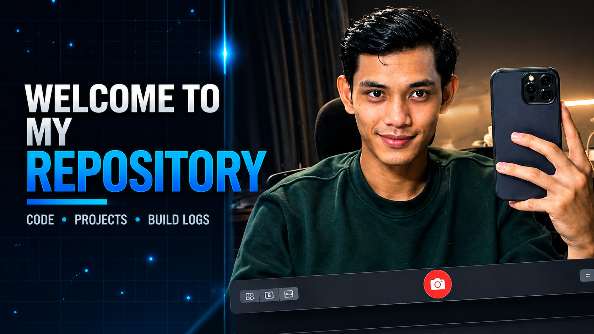

<div align="center">

# `Farrel0xx`

### AI • Machine Learning • Healthcare Technology • Automation



<p>
  <a href="https://github.com/farrel0xx">
    
  </a>
  <a href="https://www.youtube.com/@mantri0xx">
    
  </a>
</p>

> **Building practical technology for real-world problems — especially in healthcare.**

</div>

---

## 👨‍💻 About Me

I'm **Farrel0xx**, an aspiring **AI & Machine Learning practitioner** with a background in **healthcare data and administration**.

My interests sit at the intersection of:

- 🤖 Artificial Intelligence & Machine Learning
- 🐍 Python automation
- 🏥 Healthcare technology & health data
- 📊 Data processing & analytics
- ⚙️ Workflow automation
- 💻 IT & system troubleshooting
- 🎥 Technology content creation

I enjoy learning by building things, experimenting with new technologies, and turning repetitive workflows into something more efficient.

---

## 🧠 What I'm Working On

```text
┌─────────────────────────────────────────────────────────────┐
│                                                             │
│   🐍 Python Automation                                      │
│   ├── Data processing                                       │
│   ├── Administrative workflow automation                   │
│   └── Productivity tools                                    │
│                                                             │
│   🤖 AI / Machine Learning                                  │
│   ├── AI-assisted productivity                              │
│   ├── Machine learning fundamentals                         │
│   └── Practical AI experiments                              │
│                                                             │
│   🏥 Healthcare Technology                                  │
│   ├── Healthcare data                                       │
│   ├── Digital health                                        │
│   └── Health-tech innovation                                │
│                                                             │
└─────────────────────────────────────────────────────────────┘
```

---

## 🏆 Experience & Highlights

### 🏥 Healthcare Administration

Experience working with **healthcare administration and data**, including reporting, data management, documentation, and day-to-day administrative workflows.

### 🧪 HEALTHKATHON 2025 — BPJS Kesehatan

Participated in **HEALTHKATHON 2025**, developing and presenting:

> ## 🛡️ JKN CLAIM SHIELD

A health-tech project developed as part of the competition.

📜 Received a **Certificate of Appreciation** for participation and contribution.

---

## 🛠️ Tech Stack

### Languages & Data

<p>
  
  
  
</p>

### AI / ML

<p>
  
  
  
</p>

### Tools

<p>
  
  
  
  
</p>

---

## 🚀 Featured Project

### 🛡️ JKN CLAIM SHIELD

**HEALTHKATHON 2025 — BPJS Kesehatan**

A project developed for the **HEALTHKATHON 2025** competition.

**Focus:** `Healthcare Technology` • `Data` • `Innovation`

> More project details and source code will be added as the project portfolio evolves.

---

## 📺 YouTube

I also document my learning journey, technology experiments, projects, and other content on YouTube.

### 🎬 [Visit my YouTube Channel](https://www.youtube.com/@mantri0xx)

**Mantri0xx**

---

## 📈 My Learning Philosophy

```python
while True:
    learn()
    build()
    experiment()
    fail()
    improve()
```

I believe the fastest way to improve is to:

**learn → build → break → fix → repeat**

---

## 🎯 Current Goals

- [ ] Build practical AI & ML projects
- [ ] Improve Python automation skills
- [ ] Explore real-world healthcare AI
- [ ] Build a stronger GitHub portfolio
- [ ] Publish useful technical content
- [ ] Turn ideas into working products

---

<div align="center">

## `Always learning. Always building.`

⭐ If you find something useful here, consider giving the repository a star.

**© Farrel0xx**

</div>
